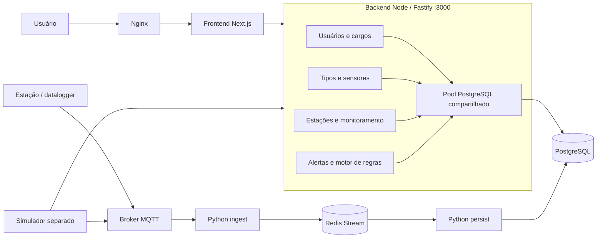

# SCRUM-475 — Arquitetura monolítica modular

## Decisão

Consolidar somente as quatro APIs Node no BACKEND. Fastify registra os módulos no mesmo processo, com um pool PostgreSQL e um único motor de regras. As dependências existentes já eram consultas ao banco compartilhado; não há HTTP interno ou broker adicional a remover/criar.

## Limites dos módulos

Usuários/cargos cuidam de credenciais e cadastro; tipos/sensores mantêm referências às estações; estações/monitoramento consultam propriedades, leituras e alertas; alertas/motor avaliam novas leituras e mantêm reconhecimento e checkpoint. As FKs, consultas SQL e transações existentes continuam válidas. A migração não muda ownership físico das tabelas nem aplica migrations.

O BANCO continua sendo a fonte de schema, seeds e migrations. O Compose principal usa o PostgreSQL externo. Apenas o overlay de testes cria PostgreSQL 16 e aplica schema/seed de desenvolvimento a um volume descartável.

## Contratos e ciclo de vida

- Uma única URL substitui as quatro portas. Rotas e aliases de negócio permanecem disponíveis.
- Handlers encapsulados preservam erros numéricos de usuários/parâmetros e erros textuais de estações/alertas.
- Healthchecks passam a representar o monolito e informar se o motor está agendado; não constituem uma sondagem da disponibilidade do PostgreSQL.
- Após abrir HTTP, o bootstrap inicia o motor se habilitado. SIGINT/SIGTERM drenam HTTP; o hook de fechamento para e aguarda o motor; por último o pool é fechado.
- A API e o motor compartilham os mesmos repositórios de alertas no bootstrap. Checkpoint e índices únicos preservam o reprocessamento seguro.
- Instanciar `buildApp` não inicia o motor. Injeções de repositórios, pool e relógio permitem testes isolados.

## Operação e transição

Manter uma instância do backend/motor nesta implantação, como no Compose. Durante a troca, parar o serviço antigo de alertas antes de habilitar o motor no monolito. Não alterar schemas ou checkpoints no banco externo. A reversão consiste em restaurar a revisão anterior do INFRA e seus submódulos, mantendo o mesmo banco e o volume Redis.

A implantação é manual e usa Docker Compose; CI apenas valida código, imagens e o E2E com banco descartável. Os repositórios antigos continuam acessíveis no GitHub para consulta histórica.

## Aceite externo

O diagrama e decisões estão versionados. O material para Confluence fica em `confluence/`, ignorado pelo Git. Publicação, validação com hardware real e aceite do time ainda precisam ser registrados pelo time responsável.
